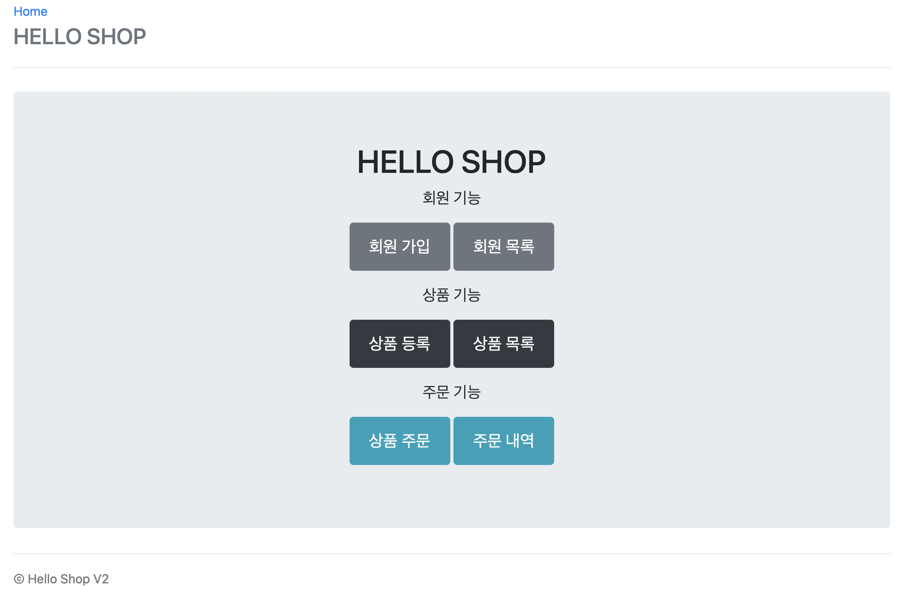
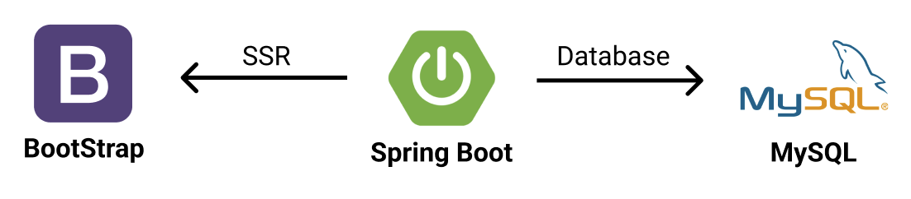

# ShoppingMall
## 프로젝트 설명

  

회원 가입을 해서 상품을 등록하고 상품을 주문할 수 있는 간단한 쇼핑몰 웹 사이트입니다.

김영한님의 Spring 강의를 참고했고, QueryDsl, Rest API 등 스스로 기능을 추가하여 완성한 프로젝트입니다.

[https://www.inflearn.com/course/스프링부트-JPA-활용-1/](https://www.inflearn.com/course/%EC%8A%A4%ED%94%84%EB%A7%81%EB%B6%80%ED%8A%B8-JPA-%ED%99%9C%EC%9A%A9-1/)

1. 회원 기능 - 등록, 조회
2. 상품 기능 - 등록, 수정, 조회
3. 주문 기능 - 주문, 조회, 취소

**첫 시작을 함께한 프로젝트**

- *백엔드 개발자가 되기로 결심하고 그 시작을 함께한, 저에게 굉장히 의미있는 프로젝트입니다.*

---

## 시스템 아키텍처

  

백엔드 서버 개발에는 `Spring Boot`를 사용했습니다.

데이터베이스는 `MySQL`을 사용했습니다.

화면은 서버 사이드 렌더링을 사용했으며, 템플릿은 `BootStrap`을 사용했습니다.
